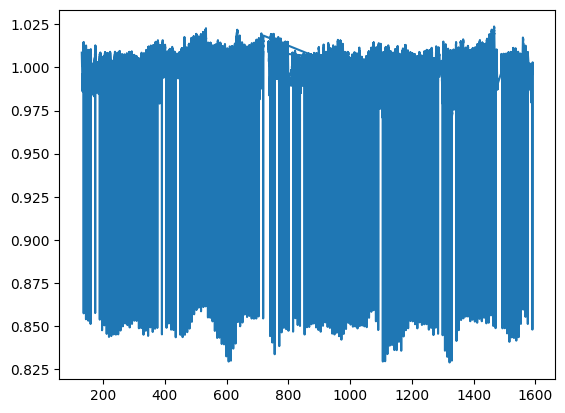
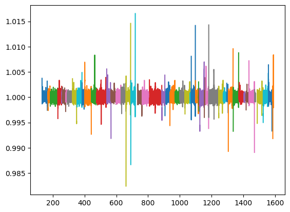

## Introduction
Eclipsing binaries present a challenge to exoplanet finders. The periodic drop in brightness from stellar eclipses typically outsizes all other features of an eclipsing binary's light curve, while tidal deformation of the stars can cause additional distortions. This is particularly problematic for unsupervised automated planet finders which are not programmed to handle them (pers. obs.).

The search for circumbinary exoplanets is additionally hampered by their non-periodic orbits, rendering strategies such as blind period matching and Fourier aliasing unusuable. This also raises the lower bound on detectable planet size as there are no ways to effectively raise transit signal-to-noise ratio.

As a result of these factors and the general rarity of eclipsing binaries, only a few dozen circumbinary planets are known compared to the many thousands of planets discovered orbiting single stars.

A literature review found that prior searches for circumbinary exoplanets have relied on manually supervised stellar eclipse masking and polynomial detrend. Masking and detrending are necessary to isolate transit signals from noisy data, but the manual steps represent severe time sinks for surveys.

This project's goal is to create a transit-detection pipeline able to analyze the increasingly large set of Kepler/TESS eclipsing binaries for planets unsupervised. 

To this end, we attempt a novel Fourier detrending solution. Despite potentially significant advantages in preserving small transit signals and eliminating noise, Fourier detrend has not been tested signficantly by past circumbinary planet workers (pers. obs.).

## Mathematical Background
The Fourier transform is an integral transform which obtains a frequency domain expression of an arbitrary input function. Essentially, the input is decomposed into a set of sine waves which when combined reproduce said input precisely.

Astrophysical sources of red noise like starspots, stellar pulsations, tidal distortions and so on tend to produce long-period sinusoidal features. Transits are isolated, short-period square waves and so are well separated from red noise in the frequency domain, so they remain untouched if low red noise frequencies are trimmed. This is in opposition to polynomial fits, which cannot distinguish between transit and noise and so inevitably decrease the signal-to-noise ratio.

# Algorithm Description
A Kepler light curve as obtained from the MAST archive consists of a barycentric Julian date time array, a corresponding optical flux array and a flux error array.

Prior to being fed into Fourier detrend, light curves must be cleaned of stellar eclipses. Since these are square waves they do not drop out nicely in Fourier detrend. An ideal pipeline would correct for them, but this is not possible without extensive modelling of stellar properties.

Eclipse start and end points are marked by the local minima of the second derivative of the light curve after it is folded with the correct period (period is given by MAST database). Eclipse period and duration are used to generate a mask of the light curve which is used to smooth over eclipses with interpolated data points.

Kepler light curves contain some gaps where the telescope was turned off to rotate. To avoid having to handle missing data, the light curve object is broken up into continuous segments, each of which is fed into detrend individually.

The Fourier fit is obtained by calculating the full Fourier transform of each data chunk then performing an inverse Fourier transformation on the first twenty frequencies. This is subtracted from the raw data to obtain the detrend.

# Implementation Details
The notebook takes the Kepler Input Catalog (KIC) number included in the MAST Kepler Eclipsing Binaries database and returns the processed time and flux arrays time_norm and flux_norm.

The detrending pipeline is dependent on the libraries numpy, pandas, torch, and lightkurve. pandas is used to open and query the CSV database file, numpy is used for all numerical and array-handling operations, lightkurve handles time-based masking and torch is used to fold the light curve in the masking step. matplotlib is recommended to visualise the returned arrays and/or other data.

# Validation
As a demonstration, the following is the raw Kepler output for the three-planet circumbinary system Kepler-47:

And this is the same system's light curve fully processed:

Algorithmically optimised polynomial fit performs about half as well as an unoptimised Fourier fit at recovering optically undetectable transits (pers. obs.), based on the publicly available transit catalog for Kepler-47.

# Performance & Limitations
Runtime efficiency is effectively independent of curve length, as the limiting step is the csv query & loading speed. All processing steps together take less than a second for the maximum four years of Kepler output.

As previously mentioned, unoptimised Fourier fit performed twice as well as unsupervised polynomial fit. Visual recovery for Kepler-47 exceeded 85% (evaluation for other systems was not possible due to the lack of publicly available complete transit catalogs).

Be aware that transits overlapping stellar eclipses will be lost, and that poor fitting at the ends of each segment can lead to the loss of 5-10 data points (2.5-5 hours) on each end.